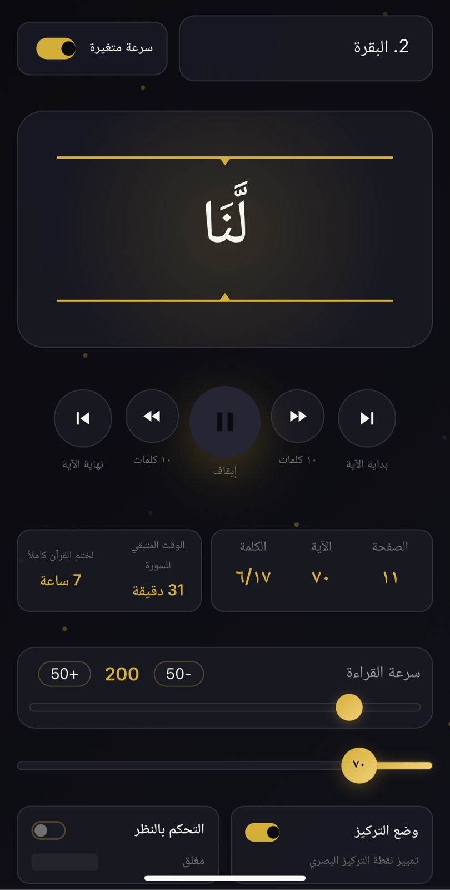
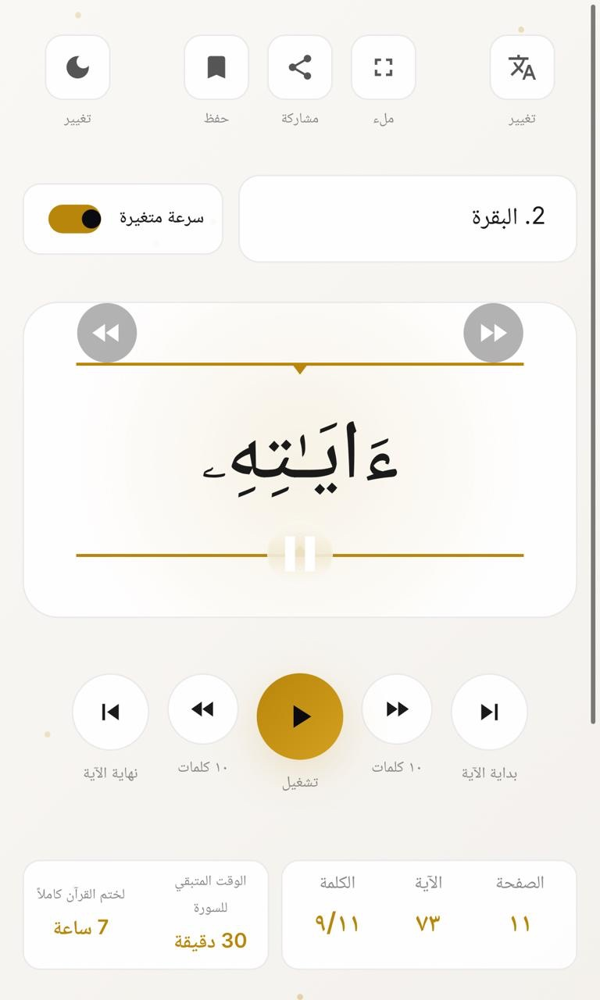
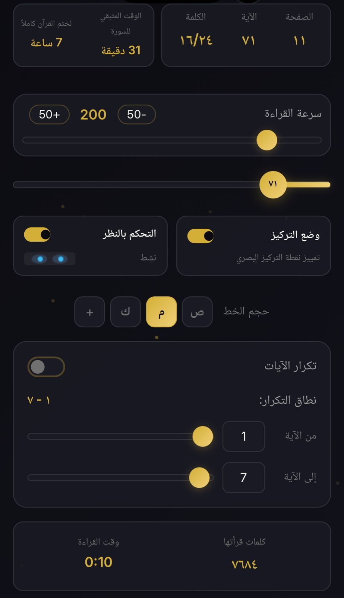
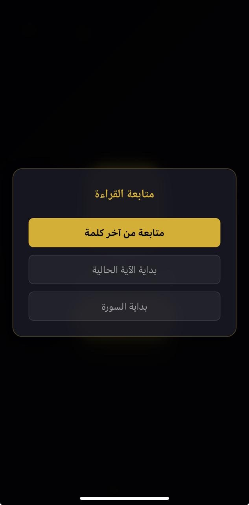

<div align="center">

# قارئ القرآن الكريم

### Quran Speed Reader PWA


**تدبّر كلمة بكلمة في سكينة تامة، بلا إعلانات ولا تتبّع. صدقة جارية.**

Read the Quran word-by-word at your own pace — no ads, no tracking. An ongoing charity.

[](https://vercel.com/new/clone?repository-url=https://github.com/YOUR_USERNAME/YOUR_REPO)
[](LICENSE)

[Live Demo](https://your-app.vercel.app) · [Report Bug](../../issues) · [Request Feature](../../issues)

</div>

---

## ✨ Features

| Feature | Description |
|---------|-------------|
| **Word-by-Word Display** | Spritz-style rapid serial visual presentation (RSVP) with ORP focus highlighting |
| **Variable Speed** | 50–1000 WPM with optional variable speed that adjusts per-word based on length |
| **Bilingual** | Full Arabic & English interface — switch anytime |
| **Memorization Mode** | Loop any range of ayahs automatically for حفظ review |
| **Dark & Light Themes** | Eye-comfortable reading in any environment |
| **Auto-Bookmark** | Remembers your exact word position — resume where you left off |
| **Eye Tracking** | Experimental gaze-based pause/play (webcam, optional) |
| **Khatma Timer** | Shows estimated time to finish the current surah and full Quran |
| **Offline Support** | Service worker caches surahs you've read — works without internet |
| **Installable PWA** | Install to home screen on Android & iOS — feels like a native app |
| **Zero Tracking** | No analytics, no cookies, no ads. Visitor counter uses [CounterAPI](https://counterapi.dev) with no personal data |

## 📱 Screenshots

<div align="center">




</div>

## 🚀 Quick Start

### Option 1: Use it directly
Visit the [live app](https://your-app.vercel.app) and install it to your device.

### Option 2: Self-host

```bash
# Clone the repo
git clone https://github.com/YOUR_USERNAME/YOUR_REPO.git
cd YOUR_REPO

# Serve locally (any static server works)
npx serve .
# or
python3 -m http.server 8000
```

Open `http://localhost:8000` — that's it. No build step, no dependencies, no framework. It's a single HTML file.

> **Note:** Service worker and PWA install require HTTPS. For local development, `localhost` is an exception.

## 🌐 Deploy

This is a static site — deploy it anywhere that serves HTML:

### Vercel (Recommended)
1. Push to GitHub
2. Go to [vercel.com](https://vercel.com) → **Add New Project** → select this repo
3. Click **Deploy** — no configuration needed
4. Every `git push` auto-deploys

### Cloudflare Pages
1. Go to [Cloudflare Pages](https://pages.cloudflare.com) → **Create a project**
2. Connect your GitHub repo
3. Build command: *(leave empty)*
4. Output directory: `/`

### Netlify
1. Go to [netlify.com](https://netlify.com) → **Add new site** → Import from Git
2. Select this repo
3. Publish directory: `/`

### GitHub Pages
1. Go to repo **Settings** → **Pages**
2. Source: Deploy from a branch → `main` → `/ (root)`
3. Your app will be live at `https://username.github.io/repo-name`

## 📂 Project Structure

```
├── index.html          # The entire app — single file, zero dependencies
├── manifest.json       # PWA manifest (app name, icons, theme)
├── sw.js               # Service worker (offline caching)
├── icons/              # App icons (72px → 1024px + maskable variants)
│   ├── icon-72.png
│   ├── icon-96.png
│   ├── icon-128.png
│   ├── icon-144.png
│   ├── icon-152.png
│   ├── icon-180.png
│   ├── icon-192.png
│   ├── icon-384.png
│   ├── icon-512.png
│   ├── icon-1024.png
│   ├── icon-maskable-192.png
│   └── icon-maskable-512.png
├── screenshot-1.png    # Play Store / PWA install screenshots
├── screenshot-2.png
├── screenshot-3.png
├── screenshot-4.png
└── README.md
```

## 🔧 Configuration

### CounterAPI (Optional)
The app uses [CounterAPI](https://counterapi.dev) for a shared visitor counter and collective reading time. To use your own:

1. Create a free account at [counterapi.dev](https://counterapi.dev)
2. Create a workspace and generate an API token
3. Update the workspace name and token in `index.html`:

```javascript
const counterClient = new Counter({
    workspace: 'your-workspace',
    accessToken: 'your-token'
});
```

If you don't set this up, the app falls back to localStorage — everything still works, just not shared across users.

### Quran API
The app fetches Quran data from [api.alquran.cloud](https://alquran.cloud/api) (free, no key required). Once a surah is loaded, it's cached by the service worker for offline use.

## 📦 Google Play Store

To publish as an Android app:

1. Deploy the app to a live HTTPS URL first
2. Go to [PWABuilder](https://pwabuilder.com) → enter your URL
3. Click **Package for stores** → **Android**
4. PWABuilder generates a Trusted Web Activity (TWA) wrapper
5. Upload the generated `.aab` file to [Google Play Console](https://play.google.com/console) ($25 one-time fee)

## 🤝 Contributing

This is a صدقة جارية (ongoing charity) project. Contributions are welcome:

1. Fork the repo
2. Create a branch (`git checkout -b feature/amazing-feature`)
3. Commit your changes (`git commit -m 'Add amazing feature'`)
4. Push (`git push origin feature/amazing-feature`)
5. Open a Pull Request

### Ideas for Contribution
- [ ] Audio recitation sync (play Sheikh's audio alongside word display)
- [ ] Tafsir integration (tap a word for explanation)
- [ ] Tajweed color coding
- [ ] Multi-language translation support beyond English
- [ ] Social sharing of reading progress
- [ ] Daily reading goals and streaks

## 📄 License

This project is open source and available under the [MIT License](LICENSE).

## 🤲 Credits

- Quran data: [Al Quran Cloud API](https://alquran.cloud)
- Fonts: [Amiri](https://fonts.google.com/specimen/Amiri) & [Noto Naskh Arabic](https://fonts.google.com/noto/specimen/Noto+Naskh+Arabic)
- Analytics: [CounterAPI](https://counterapi.dev)
- Built with pure HTML, CSS, and JavaScript — no frameworks

---

<div align="center">

**بسم الله الرحمن الرحيم**

Made with ❤️ as صدقة جارية

If this app helps you in your journey with the Quran, please make دعاء for everyone who contributed to it.

⭐ Star this repo if you find it useful

</div>
